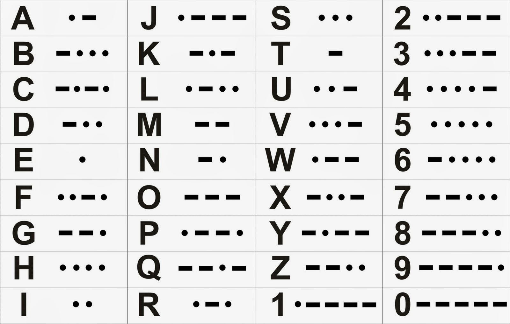
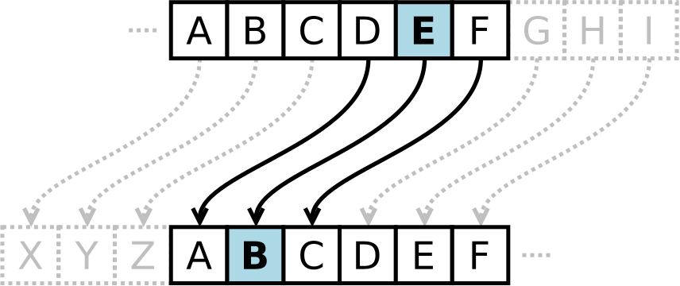

# Qué es la criptografía?

La criptografía es la ciencia de usar códigos secretos y durante muchos años ha sido usada para compartir mensajes entre spías, soldados, hackers, piratas, etc. para asegurarse que el mensaje a transmitir se mantengo secreto y únicamente pueda ser leído por su destinatario.

## Códigos

Códigos permiten susbtituir mensajes con símbolos que cualquier persona debería ser capaz de traducir, por ejemplo el código Morse.

## Ciphers

Los ciphers se utilizan para mantener un mensaje secreto, permitiendo convertir texto entendible como el Inglés en un montón de símbolos o caracteres sin un sentido alguno aparente. Un cypher es básicamente un set de reglas qaue permiten encriptar/desencriptar el mensaje, por ejemplo el Caesar cipher.

